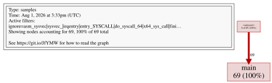
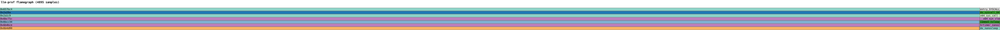
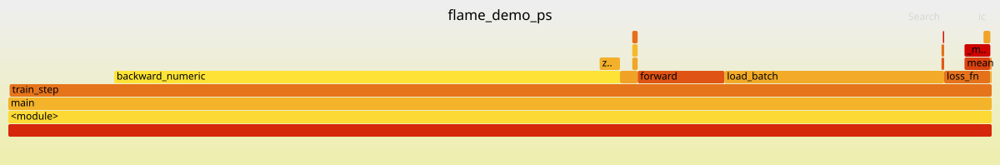
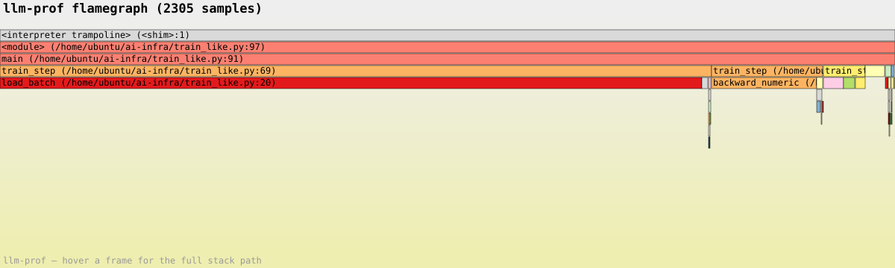
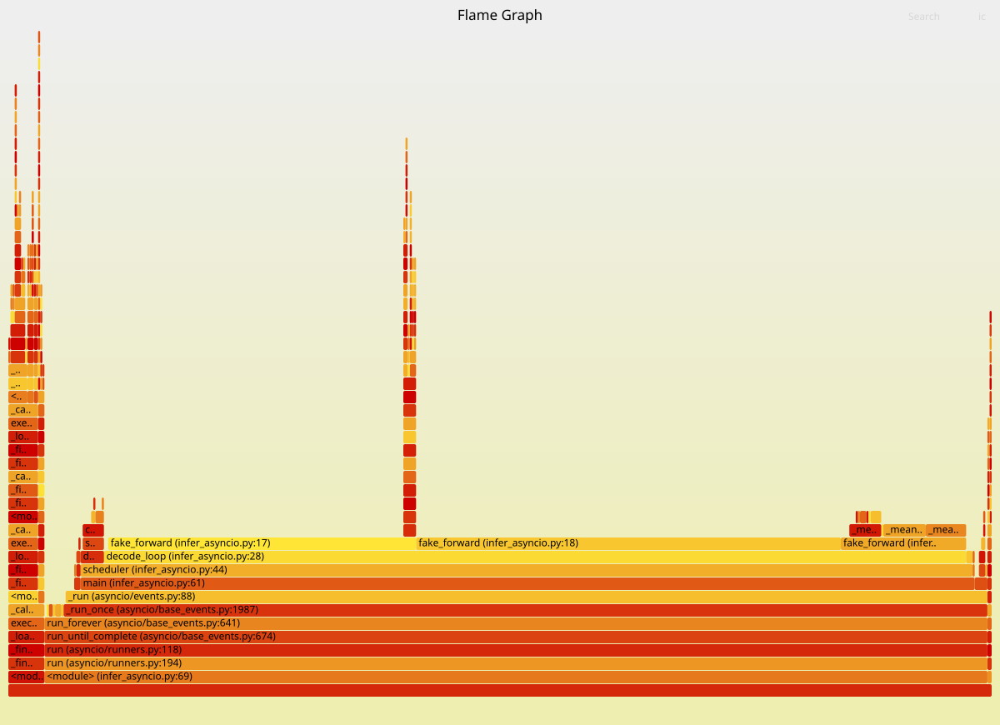
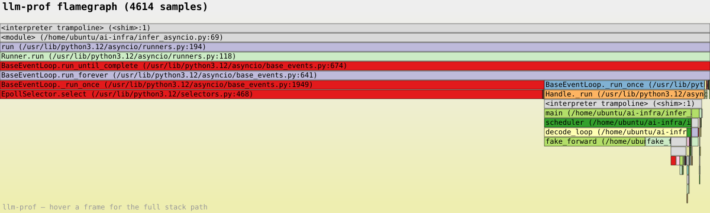
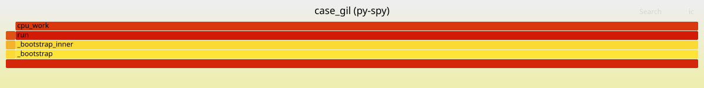
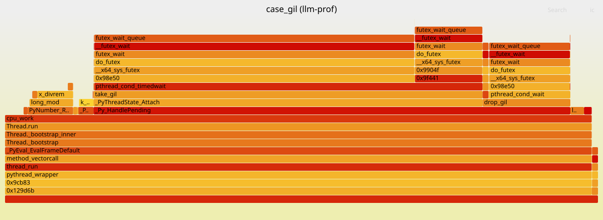
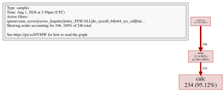
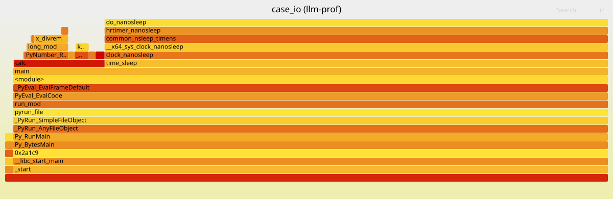

# llm-prof

面向 **LLM 训练/推理场景**的轻量级 eBPF profiler：**on-CPU + off-CPU 统一采样**，不暂停目标进程的任何线程。

基于 [opentelemetry-ebpf-profiler](https://github.com/open-telemetry/opentelemetry-ebpf-profiler) 裁剪精简（保留 eBPF native/Python unwinder 与 off-cpu 机制），on/off-CPU 统一采样思路参考 [Blocked Samples（OSDI'24）](https://github.com/s3yonsei/blocked_samples)。

```
sudo ./llm-prof/llm-prof -pid <PID> -d 10s -off-cpu-threshold 1.0 -o out.svg
```

## 特色

| 能力 | 说明 |
|---|---|
| **零暂停采样** | perf event 中断触发，eBPF 内实时解帧 + `process_vm_readv` 读内存——**从不冻结目标进程**（对比 py-spy 的 ptrace 暂停全部线程） |
| **on + off CPU 统一** | perf 采样 on-CPU 执行点 + `sched_switch` 跟踪阻塞时长（off-cpu 样本按时长加权）——IO/等待型负载（网络、数据加载、GIL 等待）不再盲区 |
| **混合栈** | Python（函数名/文件/行号）+ native C/C++（torch 算子层）+ kernel，一条火焰图 |
| **`--pid` 目标过滤** | eBPF 侧按 pid 过滤（on/off 都过滤）——ringbuffer 不被全系统事件淹没，agent CPU 占用低 |
| **时长加权口径** | off-cpu 按真实阻塞时长加权（等价采样间隔数），等待占比更接近真实时间分配 |
| **对比分析工具** | `analyze_compare.py`：与 py-spy 的归一化对比（帧集/路径/方向、total 自检、行号分布） |

## 与 py-spy 的实测对比

测试机：16 核 Ubuntu 24.04，Python 3.12，固定工作量基准（bench.py）。同批基线、各 2 轮取中位数。

### 开销（相对基线，100Hz / 1000Hz）

| 负载 | py-spy @100Hz | llm-prof @100Hz | py-spy @1000Hz | llm-prof @1000Hz |
|---|---|---|---|---|
| 单线程 CPU | +3.2% | **≈0** | +23.5% | **≈0** |
| 4 线程 GIL 争用 | +12.2% | **≈0**（off-cpu 开 ≈0） | **+26%~114%**¹ | **+9.8%**（off-cpu 开 +15.1%） |
| IO/sleep 型 | +0.8% | ≈0（off-cpu 开 +1.9%） | +6.4% | +0~2.7% |

¹ 短负载（~25s）实测 +111.5%，长负载（~32s）实测 +25.8%——量级随负载时长变化，区间更准确。

**采样率口径（公平性说明）**：llm-prof 的 `-samples-per-second` 是**每 CPU** 采样率（多线程负载下实际中断率
= 名义值 × 忙碌 CPU 数），py-spy 的 `-r` 是**每进程**采样率。上表两列均为 100/1000Hz 名义值实测
（llm-prof 为 `-samples-per-second 100/1000`，脚本 `run_replace_compare.sh` / `run_replace_1k.sh` 可复现）——
即 GIL 争用场景 llm-prof 的实际采样中断率（~4×名义值）**高于** py-spy，开销仍然更低，结论方向不受影响。
注意 llm-prof 对单进程的**有效**样本率 ≈ 名义值 × CPU 占用率（单线程 100Hz 实际约 35%），与开销无关。

### 采集能力（100Hz，off-cpu 开）

| 指标 | py-spy | llm-prof |
|---|---|---|
| 单线程行号分布（cpu_work line16） | 89.7% | **90.9%**（偏差 1.2pp） |
| 多线程 GIL 等待栈 `_wait_for_tstate_lock` | 1.1% | **1.1%（off-cpu 补齐）** |
| IO 等待点 `main:42` | ≈100% | **≈100%** |
| 等待型负载样本量 | 88 | **4238（约 48 倍）** |

### 同一负载的对比图（IO/sleep 型，100Hz）

所有对比图统一流程：py-spy 与 llm-prof 都先输出 **pprof**（llm-prof 直接 `-o .pb.gz`，py-spy raw 经 `pyraw2pprof` 转换），再用 `go tool pprof -svg` 统一渲染（`demo-cases/gen_unified_svgs.sh`），两侧渲染风格完全一致。

左侧 py-spy（采样点快照），右侧 llm-prof（on+off 统一，时长加权）——同样的等待点 `main (bench.py:42)`，llm-prof 的样本量约为 48 倍：

| py-spy | llm-prof |
|---|---|
|  |  |

### 训练循环 demo（模拟 LLM 训练：数据加载 IO + 前向 + 数值反向 + checkpoint）

同一 demo（train_like.py，python3.12+numpy，100Hz）双工具采样，**top5 栈完全重合**，
但瓶颈排序不同（栈顶帧分布，analyze_compare.py 口径，排除空栈行）：

| 栈顶帧 | py-spy（采样点快照） | llm-prof（off-cpu 时长加权） |
|---|---|---|
| `load_batch`（含模拟 IO 等待） | 22.4% | **78.5%** |
| `backward_numeric`（numpy 数值反向） | 47.1% | 11.8% |
| `forward`（前向传播） | 8.3% | 3.6% |

**关键**：demo 每步有 2ms 模拟 IO（sleep）——真实时间分配中等待占约 78%。
llm-prof 的 off-cpu 时长加权正确揭示"瓶颈在 IO 等待"；py-spy 的采样点快照
（ptrace 难以停住睡眠线程）**低估等待时间约 3.5 倍**，会把你的优化方向
误导到 `backward_numeric`（只占真实时间 12%）。

| py-spy | llm-prof |
|---|---|
|  |  |

### asyncio 推理服务 demo（vLLM/TGI 同架构：事件循环 + 并发请求）

`infer_asyncio.py`：8 并发请求、调度器 batch 组装、逐 token 解码（前向 +
2ms 间隙等待）、周期 metrics 事件。100Hz 双工具采样（各 16s）：

| 栈顶帧 | py-spy | llm-prof（off-cpu 时长加权） |
|---|---|---|
| `fake_forward`（前向计算） | 73.2% | 17.8% |
| `EpollSelector.select`（事件循环等待） | 未采到 | **76.4%** |
| 样本量 | 463 | **4614（10 倍）** |

**关键**：asyncio 事件循环大部分时间在 `epoll_wait`（内核睡眠）。py-spy
的 ptrace 机制停不住内核睡眠中的线程——**等待时间几乎完全丢失**，火焰图
73% 显示为"计算"（实际只占真实时间约 18%）。llm-prof 的 off-cpu 时长加权
正确显示 **76.4% 的等待**——对 vLLM 这类 asyncio 架构，py-spy 会系统性
误导"瓶颈在计算"，而真实瓶颈往往是 batch 间隙 / IO 等待。

| py-spy | llm-prof |
|---|---|
|  |  |

### 1000Hz 的观测者效应（重要发现）

1000Hz 下 **py-spy 的 `join`（主线程等待）样本从 1% 虚高到 15.3%**——每毫秒暂停冻结全部线程本身就在加剧 GIL 争用，火焰图里多出的"等待"很大部分是采样器自己造成的；llm-prof（无暂停）保持接近真实。注意矩阵实验中 GIL 等待栈 `_wait_for_tstate_lock` 在两轮里均为 0%：ptrace 机制采不到睡眠中的线程，py-spy 的 GIL 争用负载只会显示"计算"或"主线程 join"，需要结合开销曲线判断。

### 问题定位能力矩阵（4 个构造 case）

构造 4 个带明确"问题"的负载（`demo-cases/`，各 ~30s 固定工作量），每个配置用**独立进程分轮采样** 12s
（py-spy attach 与 llm-prof attach 各一轮，非同一进程同段），对比**问题定位能力**（栈顶帧是否命中真实瓶颈）
与**开销**（固定工作量运行时长增长 %）。注意 GIL case 基线波动约 ±8%，其开销数字只作方向参考；

| case | 真实问题 | py-spy 100Hz | py-spy 1000Hz | llm-prof off-cpu=1.0 |
|---|---|---|---|---|
| `case_hotspot.py` 单线程热点（`bottleneck` 占 90%） | 定位 `bottleneck` | 命中 91%，开销 +3.9% | 命中 91%，开销 **+32.1%** | 命中 90%，开销 +0.7% |
| `case_gil.py` 4 线程 GIL 争用（~90% 时间等 GIL） | 识别"等锁"而非计算 | **0% 等待**（全显示计算），开销 +0.8% | **0% 等待**，开销 +25.8%（观测者效应 `join` 虚高 15%） | **等待可见 89%**，开销 +2.7% |
| `case_io.py` sleep 等待 79% / 计算 21% | 定位等待点 | 样本有效率仅 **25%**，等待可见 5%（误导为 `calc` 84%） | 等待可见 21%，开销 +12.5% | **等待可见 73%**（真实 79%），开销 -0.3% |
| `case_misleading.py` 高频短调用 `noisy` vs 低频长调用 `real_bottleneck` | 不被调用频率误导 | 命中 89%，开销 +5.3% | 命中 90%，开销 **+32.3%** | 命中 92%，开销 ~0% |

**关键结论**：纯 CPU 热点两工具定位能力相当（89-92%），差距在开销（py-spy 1000Hz 拖慢 26-32%，
llm-prof 全配置 <1%）；**负载含任何等待（锁/IO/sleep）时 py-spy 结构性丢失**——GIL 等待 0%、
sleep 只看到 5-21%，且把等待负载误显示为"计算占 84%"；llm-prof 开 `-off-cpu-threshold 1.0`
后等待可见性 73-89% 与真实时间分配吻合，1000Hz 下开销仍接近零。

火焰图对比（GIL 争用 case，左侧 py-spy 全显示计算、右侧 llm-prof off-cpu 揭示 89% 等锁；两图均为 `go tool pprof -svg` 统一渲染）：

| py-spy | llm-prof |
|---|---|
|  |  |

IO 等待 case（左侧 py-spy 采不到睡眠线程、右侧 llm-prof off-cpu 显示 73% 等待）：

| py-spy | llm-prof |
|---|---|
|  |  |

复现：`demo-cases/run_case_matrix.sh`（llm-prof 全矩阵）、`demo-cases/run_pyspy_matrix.sh`（py-spy 补跑），
结果用 `demo-cases/analyze_matrix.py` 汇总（原始数据见 `demo-cases/mx_results.txt`）。

### 已知差异（实事求是）

1. **行号分布口径**：llm-prof 的 off-cpu 用**时长加权**、py-spy 用**采样点快照**——多线程下行号分布有约 9pp 系统差异（时长加权更接近真实时间占比，但两工具数字不可直接混用）；
2. **启动期杂项**：py-spy 能采到进程启动/退出期的 import 等杂项栈，llm-prof 只采 on/off CPU 执行点（差异 <1%）；
3. **部署门槛**：llm-prof 需要 root + `CAP_BPF`（仅 Linux）；py-spy 普通用户即可、跨平台；
4. **采样率语义**：`-samples-per-second` 为每 CPU 周期，单进程实际样本率视负载而定（实测 100Hz 下单线程约 35%、IO 型约 21%），对比前先校准样本量级。

**结论**：在有 root 权限的 Linux 环境，llm-prof 可平替 py-spy——性能更优（多线程 100Hz -12pp、1000Hz -96pp）、等待覆盖对齐、样本量反超；1000Hz 高频场景 py-spy 因开销与观测者效应基本不可用，llm-prof 是唯一合理选择。

## 用法

```
# attach 运行中的进程，采样 10 秒（on+off CPU），输出火焰图
sudo ./llm-prof/llm-prof -pid <PID> -d 10s -off-cpu-threshold 1.0 -o out.svg

# 输出 Google pprof 格式（.pprof/.pb/.pb.gz），与 py-spy 统一对比：
sudo ./llm-prof/llm-prof -pid <PID> -d 10s -off-cpu-threshold 1.0 -o out.pb.gz

# 参数
#   -pid <PID>            目标进程（0 = 全部）
#   -d <duration>         采样时长（0 = 直到 SIGINT）
#   -samples-per-second N 采样率（每 CPU，默认 20）
#   -off-cpu-threshold P  off-cpu 采样概率 [0..1]，0 禁用（默认），1.0 全采
#   -topn N               文本输出栈数（0 = 全部）
#   -python-only          只保留 Python 帧（按 unwinder 报告的帧类型过滤，
#                         不会误保留 "memcpy (libc.so.6:123)" 这类 native 帧）
#   -send-error-frames    输出 unwind 失败的样本（默认 true，渲染为
#                         [unwind-error] 帧，避免"瓶颈百分比异常"却看不到原因）
#   -o <path>             输出路径，按扩展名选择格式：
#                            .svg   火焰图（默认）+ 同路径 .txt（top-N）
#                            .pprof / .pb / .pb.gz   Google pprof protobuf（.gz 压缩）
```

输出：`out.svg`（火焰图）+ `out.txt`（top-N 栈统计）；或 `out.pb.gz`（pprof）+ `out.txt`。

### 与 py-spy 的 pprof 统一对比

py-spy 本身不输出 pprof，但它的 raw 文本可以一键转换（根到叶、带计数，与 llm-prof 栈格式同构）：

```bash
py-spy record -r 100 --format raw -o py.txt --pid <PID> -d 12
llm-prof/llm-prof -pid <PID> -d 12s -o lp.pb.gz          # 或 llm-prof 目录下构建的二进制
go build -o pyraw2pprof ./cmd/pyraw2pprof && ./pyraw2pprof py.txt py.pb.gz

# 统一用 go tool pprof / pprof 分析两份数据：
go tool pprof -top py.pb.gz
go tool pprof -top lp.pb.gz
go tool pprof -diff_base=py.pb.gz lp.pb.gz   # 或直接并排对比
```

### 火焰图可视化：pprof → Pyroscope / Grafana / Parca

pprof 是持续 profiling 生态的标准格式，llm-prof 的 `.pb.gz` 可直接喂给主流的火焰图可视化后端（均已实测）：

**Pyroscope（Grafana 的 profiling 后端，最轻量）**——单容器自带 Web UI 火焰图：

```bash
docker run -d --name pyroscope -p 4040:4040 grafana/pyroscope:latest
# llm-prof / pyraw2pprof 转换出的 pprof 直接上传（重新采样以保证时间戳新鲜）：
demo-cases/push_to_pyroscope.sh lp.pb.gz llm-prof
demo-cases/push_to_pyroscope.sh py.pb.gz py-spy
# 浏览器打开 http://localhost:4040 查看火焰图（Pyroscope 默认摄取窗口约 1 小时）
```

**Grafana**——内置 Pyroscope 数据源（`grafana-pyroscope-datasource`），数据源指向 Pyroscope 后即可在
Flame Graph 面板查看；也可用内置 **Parca 数据源**对接 Parca。

**Parca**——原生接受 pprof（`POST /profiles/writeraw`，body 为 protobuf JSON，
`raw_profile` 字段放 pprof 文件 base64），自带 :7070 火焰图 UI。

注意：llm-prof 开 off-cpu 时样本按**阻塞时长加权**，且 off-cpu 样本的栈顶是调度器帧
（`finish_task_switch`）——用 `-cum` 视图或过滤内核帧可看到真实等待点（如 GIL 的
`futex_wait` / `do_futex`）；py-spy 只有 on-CPU 采样点快照，看不到睡眠中的等待。

## 构建

```bash
# Rust 符号化库（symblib-capi）
cargo build --release -p symblib-capi

# eBPF 程序 + Go agent
make EBPF_FLAGS="CLANG_FORMAT=true" ebpf
go build -tags osusergo,netgo -o llm-prof .
```

依赖：Linux 内核 ≥5.13（BTF）、clang、Go ≥1.25、Rust ≥1.88。

## Credits

- 核心 eBPF 程序与 Python unwinder 裁剪自 [opentelemetry-ebpf-profiler](https://github.com/open-telemetry/opentelemetry-ebpf-profiler)（Apache-2.0），保留了其 perf_event 采样、native unwind、Python 3.6-3.14 支持与 off-cpu 机制；
- on/off-CPU 统一采样思路参考 [Blocked Samples（OSDI'24，Minwoo Ahn et al.）](https://github.com/s3yonsei/blocked_samples)：把阻塞状态记录在切换时刻，让采样同时覆盖 on/off-CPU；
- 本仓库基于 Apache-2.0 许可（见 LICENSE）。
